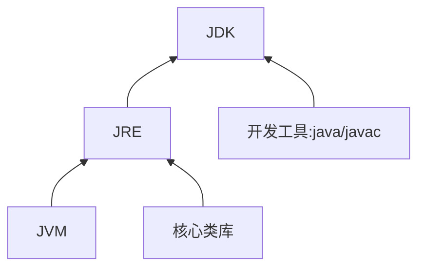

# JDK组成

```mermaid
graph BT
JVM --> JRE
核心类库 --> JRE

JRE --> JDK
开发工具:java/javac --> JDK
```

1. JDK : Java Development Kit，Java开发工具包
2. JRE：Java Runtime Environment，Java运行环境
3. JVM：Java Virtual Machine ，Java虚拟机，真正运行Java程序的地方
4. 核心类库：Java已经写好的程序，可供调用

