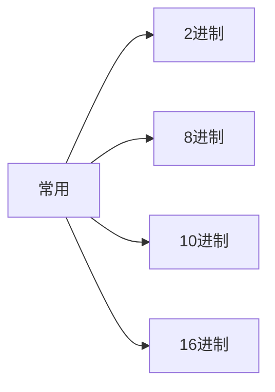

 ## 2进制

1. 用`0、1`来表示数据；

2. 格式：`0b110` 表示二进制数：110；

## 8进制

1. 用`0-7` 表示数据；
2. 格式：`010`表示8进制数10；

## 16进制

1. 用`0-9,a-f` 表示数据；
2. 格式：`0x110` 表示16进制数110；

## 任意进制到十进制的转换

公式：`系数 * 基数的权次幂，相加`

系数：当前位置上的数值；

基数：进制数；

权：从右往左，0开始，依次加1；

## 十进制转任意进制

公式：`十进制数除以基数，再取余，将余数倒着拼接，完成转换`

