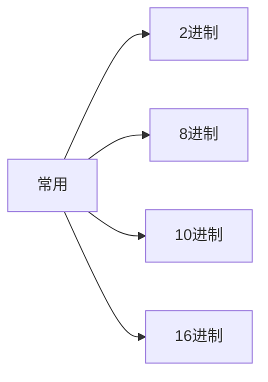

```mermaid
graph LR
常用 --> 2进制
常用 --> 8进制
常用 --> 10进制
常用 --> 16进制
```

 ## 2进制

1. 用`0、1`来表示数据；

2. 格式：`0b110` 表示二进制数：110；

## 8进制

1. 用`0-7` 表示数据；
2. 格式：`010`表示8进制数10；

## 16进制

1. 用`0-9,a-f` 表示数据；
2. 格式：`0x110` 表示16进制数110；

