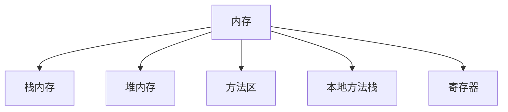

# 1.一维数组

## 1.数组介绍

1. 用于存储**相同数据类型**数据的容器；
2. 建议：容器类型 与 数据类型 相同；


## 2.数组的定义

```java
格式：
  1.数据类型[] 数组名;
	2.数据类型 数组名[];
int[] a;
int b[];
byte[] c;
byte d[];
```


## 3.数组的初始化

### 3.1 动态初始化

初始化时，手动指定数组长度，系统为数组容器分配初始值；

```java
格式：数据类型[] 数组名 = new 数据类型[数组长度]
int[] arr = new int[5];
System.out.println(arr); // 打印数组变量名，输出内存地址；假设a输出：[I@372f7a8d;
// [ : 表示当前空间是一个数组类型；
// @ : 分隔符；
// I : 表示当前数组容器中所存储的数据类型；
// 372f7a8d : 十六进制内存地址；
```


### 3.2 静态初始化

初始化时，可以指定数组要存储的元素，系统自动计算出数组的长度；

```java
格式：数据类型[] 数组名 = {数组内容}；
int[] arr = {1,2,3};
System.out.println(arr[0]);
System.out.println(arr[1]);
System.out.println(arr[2]);
```


### 3.3 动态与静态的对比

动态初始化：手动指定**数组长度**，系统给出默认初始化值；

静态初始化：手动指定**数组元素**，系统会计算元素个数，给出数组长度；

使用场景：

1. 只知道元素个数，不知道具体数值时，推荐动态初始化；
2. 明确操作的具体数据，直接使用静态初始化；


## 4. 数组元素的访问

1. 数组元素通过**索引**访问数组容器中的空间位置；
2. 索引从0开始，是连续的；

```java
int[] arr = new int[3];
System.out.arr[0]; //注意：初始化后没有赋值，也可以访问每个元素，但都是默认值；0
System.out.arr[1];
System.out.arr[2];

//赋值
arr[0] = 12;
arr[1] = 22;
```


## 5.JAVA中的内存分配

1. Java程序在运行时，需要在内存中分配空间；
2. 为提高效率，对空间进行了划分；
3. 每片区域都有特定的处理数据方式和内存管理方式；

4. 各区域：



> 1. 栈内存：方法运行时进入。局部变量都存放于这块变量中；
> 2. 堆内存：new 方法创建的内容，都会进入堆内存，且存在地址值；
> 3. 方法区：字节码文件(.class)加载时进入的内存；
> 4. 本地方法栈：调用操作系统相关资源；
> 5. 寄存器：交给CPU使用；

### 5.1 一个数组的内存分配

```java
// ArrayMap.java
public class ArratMap{   //1.编译后的字节码文件，进入*方法区*。
  public static void main(String[] args){  //2.main方法被JVM自动调用，进入*栈内存*执行。
    int[] arr = new int[3];   // 3.arr数组在main方法中被申明。
    //4.通过new关键字，在*堆区域*中开辟内存空间，产生地址值。
    //5.将地址值返回给main方法中的arr变量。
    System.out.println(arr[0]);
    System.out.println(arr[1]);
    System.out.println(arr[2]);
    arr[0] = 10;  
    arr[1] = 10;
    arr[2] = 10;
    System.ou.println(arr[0]);
    System.ou.println(arr[1]);
    System.ou.println(arr[2]);
  }
}
```

|   数据类型   |      默认值      |
| :----------: | :--------------: |
|     整数     |        0         |
|    浮点数    |       0.0        |
|     布尔     |      false       |
|     字符     | 空字符，'\u0000' |
| 引用数据类型 |       null       |

引用数据类型：引用、记录了地址值的变量，所对应的数据类型，就是引用数据类型；


### 5.2 两个数组的内存图

```java
// ArrayMap.java
public class ArratMap{   //1.编译后的字节码文件，进入*方法区*。
  public static void main(String[] args){  //2.main方法被JVM自动调用，进入*栈内存*执行。
    int[] arr1 = new int[3];   // 3.arr1数组在main方法中被申明。
    //4.通过new关键字，在*堆内存*中开辟内存空间，产生地址值。
    //5.将地址值返回给main方法中的arr1变量。
    System.out.println(arr[0]);
    System.out.println(arr[1]);
    System.out.println(arr[2]);
    arr1[0] = 10;  //6.更改指定索引位置的值
    arr1[1] = 20;
    arr1[2] = 30;
    
    int[] arr2 = new int[2]; //7.arr2在main方法中被声明。
    // 8.通过new方法，在*堆内存*中开辟*新的*内存空间。
    // 9.将新内存空间的地址值返回给main方法中的arr2变量。
    arr2[0] = 11;
    arr2[1] = 22;
  }
}
```


### 5.3 多个数组指向相同的内存空间

```java
int[] arr1 = new int[2];
arr1[0] = 10;
arr1[1] = 20;
System.out.println(arr1[0]);//arr1[0] == 10;
System.out.println(arr1[1]);//arr1[1] == 20;

int[] arr2 = arr1; //arr2指向了arr1的内存地址，也可通过索引获取、修改值
arr2[0] = 30;
System.out.println(arr2[0]); //arr2[0] == 30;  修改了索引0位置的值
System.out.println(arr2[1]); //arr2[1] == 20;

System.out.println(arr1[0]) //arr1[0] == 30; 由于地址值相同，arr2[0]的修改，arr1[0]也为30

```

## 6.数组操作常见问题

1. 索引越界：访问了数据中不存在的索引，造成越界问题；
2. 空指针异常：访问的数组已不再指向堆内存的数据，造成空指针异常；
3. null：引用数据类型的默认值，表示不指向任何有效对象；

```java
int[] arr = new int[3];//声明数组arr，new方法在堆内存中开辟了空间，返回地址值给变量arr；
arr = null;//将arr所存储的地址值更改为null，不指向原来的数组空间了；
System.out.println(arr[1]);//会异常，无法访问到指定数据；
```

## 7.数组常用操作

### 7.1 遍历

```java
//使用for循环
int[] arr = {11,22,33,44};
for(int i=0;i<4;i++){
  System.out.println(arr[i]);
}
```


### 7.2 获取数组元素数量

```java
//使用 .length 方法获取
//结合for循环使用
int[] arr = {1,2,3,4,5};
for (int i=0;i<arr.length;i++){
  System.out.println(arr[i]);
}
```


### 7.3 获取数组元素中的最大值

```java
//思路：让数组第一个元素与后面的每个元素逐一比较，创建Max变量存储最大值，若遇到更大的值，则替换Max值。
int[] arr = {1,2,33,12,23,66};
int Max = arr[0];
for (int i=0;i<arr.length;i++){
  if (arr[i] > Max){
    Max = arr[i];
  }
}
System.out.println(Max);
```


### 7.4 数组元素求和

```java
//键盘录入5个数，将其放入数组，并求和
Scanner in = new Scanner(System.in);
int sum = 0;
int[] arr = new int[5]; //由于只知道元素个数，而不知道具体数值，使用动态分配；
for (int i=0;i<5;i++){ //利用for循环录入
  System.out.println("输入5个整数：");
  arr[i] = in.nextInt();
}
for (int i=0;i<5;i++){ //利用for循环累加
  sum += arr[i];
}
System.out.println(sum);
```


### 7.5 查找元素

```java
//给定数组，键盘录入一个数，查询是否在数组内，若在则返回索引号，不再则返回-1；   //有问题
Scanner in = new Scanner(System.in);
int find = in.nextInt(); //接收输入；
int index; //接收索引号；
int[] arr = {1,2,3,4,5}//已知数组元素，直接使用静态初始化；
for (int i=0;i<arr.length;i++){
  if (find == arr[i]){
    index = i;
    System.out.println(index);
    break; //找到匹配项之后，跳出循环；若不跳出，后续每遍历一次，就会输出一次；
  }else{
    System.out.println(-1) //数组中没有则返回-1；
  }
}
```

```java
//打分案例，键盘输入6个评分，去掉最高和最低分，计算分数之和
Scanner in = new Scanner(System.in);
int[] arr = new int[6]; //不确定具体数据，使用动态初始化；
int Max;
int Min;
int Sum;
//for给数组赋值
for (int i=0;i<arr.length;i++){
  arr[i] = in.nextInt();
}
//for求最大值
Max = arr[0];
for (int i=0;i<arr.length;i++){
  if (arr[i] > Max){
    Max = arr[i];
  }
}

//for求最小值
Min = arr[0];
for (int i=0;i<arr.length;i++){
  if (arr[i] < Min){
    Min = arr[i];
  }
}

//for求和
for (int i=0;i<arr.length;i++){
  sum += arr[i];
}

System.out.println(sum)
```

### 7.6 数组反转

```java
//利用for将开头与结尾的元素互换，直到全部更换一次
int[] arr ={1,2,3,4,5};
for(int start=0,end=arr.length-1;start<end;start++,end--){
  int temp;//创建临时变量，存储元素值；
  temp = arr[start]; //将数据[0]位置的值放入temp；
  arr[start] = arr[end];//将数组最后一个元素的值，放入[0]位置；
  arr[end] = temp;//将原数组[0]位置的值，放入末尾位置；此时完成首位互换；
}
for(int i=0;i<arr.length;i++){
  sout(arr[i]); //打印数组每个元素
}

```


### 7.7 例题积累 卡了很久的题

```java
/*分析以下需求并用代码实现：
1.统计整数1-100（包括1和100）之间能同时被3和7整除的数字的个数
2.使用步骤1统计的个数创建该长度的数组
3.使用该数组存储整数1-100（包括1和100）之间能同时被3和7整除的数字  /重点看这部分的实现，开始做时卡了很久
4.遍历数组，打印数组内元素，格式示例如下：
[元素1,元素2，元素3...]
*/
//1.
int count = 0;
for(int i=1;i<=100;i++){
  if(i%3==0 && i%7==0){
    count++;
  }
}
//2.
int[] arr = new int[count];
//3.
int j = 0;
for (int i =1;i<=100;i++){   //对循环的执行流程还不熟悉，还很死板
  if(i%3==0 && i%7==0){
    arr[j] = i;
    j++;
  }
}
//4.
sout ....
```

```java
/*
有一个数组，其中有十个元素从小到大依次排列 {12,14,23,45,66,68,70,77,90,91}。再通过键盘录入一个整数数字。
要求：把数字放入数组序列中，生成一个新的数组，并且数组的元素依旧是从小到大排列的。
*/
int[] arr1 ={1,2,3,5,6,7};
int[] arr2 = new int[arr1.length+1]l;

Scanner in = new Scanner(System.in);
sout("输入：");
for(int i=0;i<arr1.length;i++){
  arr2[i] = arr1[i];
}
```


# 2.二维数组

一维数组存储数据，二维数组存储一维数组；

## 1.二维数组的初始化

### 1.1 二维数组的动态初始化

```java
格式:
数据类型[][] 变量名 = new 数据类型[m][n];
数据类型 变量名[][] = new 数据类型[m][n];
数据类型[] 变量名[] = new 数据类型[m][n];

m:存储一维数组的数量；
n:每个一维数组存储元素的数量；
```

```java
int[][] arr = new int[2][2];//能存储2个一维数组，且每个一维数组能存储2个元素；new方法在堆内存中开辟空间存放二维数组，每个一维数据也会开辟独立空间；
sout(arr);//arr中存储了这个二维数组的地址值；
// 例如：输出为：[[I@372f7a8d
// [[:表示为二维数组，有多少[，就是几维；
// @:分隔符；
// 372f7a8d：十六进制地址值；

sout(arr[0]);//arr[0]中记录了第一个一维数组的地址值；
sout(arr[1]);//arr[1]中记录了第二个一维数组的地址值；

sout(arr[0][0])； //arr[0][0]中存储的是第一个数组的第一个元素值；
  
int[] arr1 = {1,2}; //在堆内存中开辟独立空间；
arr[0] = arr1; //二维数组的第一个数组地址，指向arr1的地址；
arr[0][0] // 1
```


## 1.2 二维数组的静态初始化

```java
格式:
数据类型[][] 变量名 == {{},{}...};
```

```java
int[][] arr = {{1,2,3},{4,5,6}};
arr[0][0];
------------------------
int[] arr1 = {1,2,3};
int[] arr2 = {4,5,6};
int[][] arr = {arr1,arr2};
```


## 2.二维数组的操作

### 2.1 遍历

```java
//1.先取出二维数组中的每一个一维数组
//2.再取出每一个一维数组中的元素
int[][] arr = {{1,2,3},{4,5,6}};
for (int i=0;i<arr.length;i++){ //取出每一个一维数组；
  int[] temp = arr[i]; //定义一个临时数组，存储数组值；
  for(int j=0;j<arr[i].length;j++){
    sout(temp[i]); //打印数组中的每一个元素；
  }
}
```

### 2.2 求和

```java
//1.定义变量，用于记录累加值；
//2.创建二维数组；
//3.遍历数据，并求和
int sum = 0;
int[] arr1 = {11,21,34};
int[] arr2 = {21,24,12};
int[] arr3 = {32,12,34};
int[][] arr = {arr1,arr2,arr3};
for(int i =0;i<arr.length;i++){ //获取每个一维数组
  int[] temp = arr[i];
  for(int j = 0;j<arr[i].length;j++){ //获取一维数组中的每个元素
    sum += temp[j]; //元素累加
  }
}
sout(sum);
```

```java
//单独计算每个一维数组的元素和并输出
int[][] arr = {{11,22,33},{22,12,42}};
//int sum = 0; 若定义在for外部，则是累加全部一维数组的元素值，无法达到独立计算每个一维数据元素值的效果
//期望在每一次计算完一维数组和后，重置sum的值，就可以单独算出每一个一维数组的值
for(int i=0;i<arr.length;i++){
  int sum = 0;//在外层循环中，定义sum，内层循环结束后，即一个一维数组计算完毕后，可重置sum。
  for(int j=0;j<arr[i];j++){
    sum += arr[i][j];
  }
  sout(sum)
}
```

