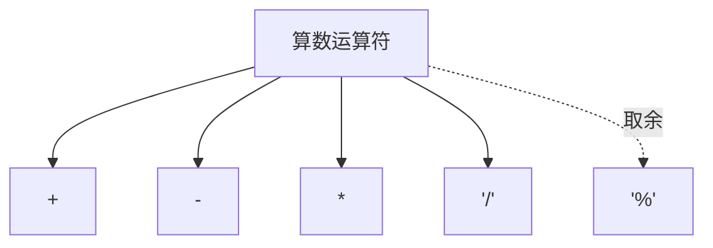
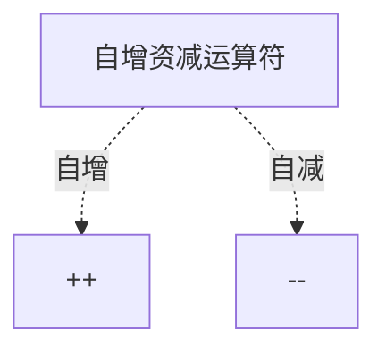
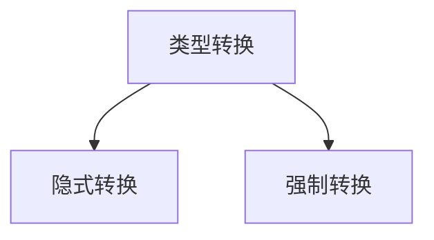
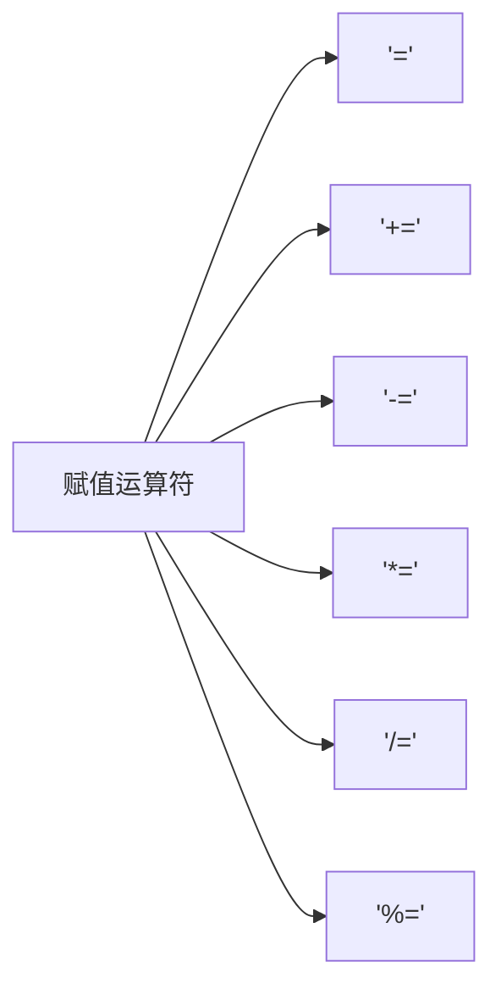
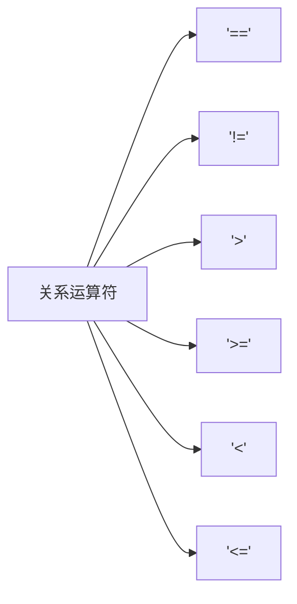
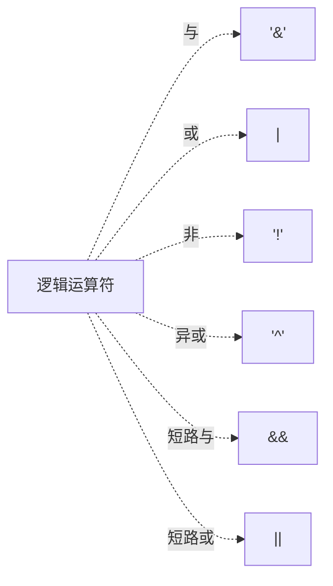

## 1.算数运算符




### 1.1 取余案例

```java
//输入一个3位数，拆分百分位、十分位、个位的值
Scanner in = new Scanner(System.in);
int num = in.nextInt();

num1 = num % 10; //得到个位数值
num2 = num / 10 % 10; //得到十分位数值
num 3 = num /100; //得到百分位数值
```


## 2.自增资减运算符



> 注意：
>
> 1. a++ :变量先参与运算，再自增
> 2. ++a:变量先自增，再参与运算

## 3.类型转换



### 3.1 隐式转换

1.将取值范围较小的数值或变量，赋值给取值范围较大的变量；

```java
byte a =10;
int b;
b = a;
```

2.取值范围小的数据与取值范围大的数据运算时，会先将小的提升为大的类型，再运算

```java
int a = 10;
double b = 20;
double c = a + b;
```

3.byte、short、char 三种类型运算时，会先提升为int类型，再运算；

```java
byte a = 10;
byte b = 20;
int c = a + b;
```


### 3.2 强制转换

将取值范围较大的数据或变量，赋值给取值范围较小的变量；

不允许直接转换，需要进行强制转换；

格式：目标数据类型 变量名 = （目标数据类型）被强转的数据；

```java
byte a =10;
int b = (int) a;
```


## 4.赋值运算符



注：扩展赋值运算，**隐含**了强转类型转换；

```java
int a = 10;
double b = 12.1;
a = a + b; //无法编译，未进行强制转换。改为：a = (int)(a + b) 可通过编译；
a += b; //可以编译，隐含强制类型转换，此时（a+b）值的类型强制转为int；
```


## 5.关系运算符



> 关系运算符的结果都为**boolean**类型


## 6.逻辑运算符



短路与&&：若左侧为true，则执行右侧；若左侧为false，右侧不执行；

短路或||:若左侧为TRUE，右侧不执行；左侧为false，右侧执行；


## 7.三目运算符

格式：判断条件 ? True : False;

```java
//求3个数的最大值
Scanner in = new Scanner(System.in);
int num1 = in.nextInt();
int num2 = in.nextInt();
int num3 = in.nextInt();

int tempMax = num1 > num2 ? num1 : num2;
int Max = tempMax > num3 ? tempMax : num3;
```


## 8.运算符优先级

无需记忆，注意利用**括号**就行

