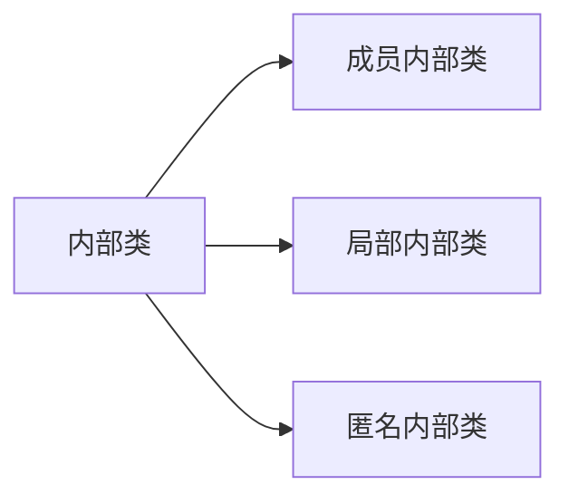

# 1.内部类




## 1.1 概述

- 定义在类中的类，称为内部类
- 访问特点
  - 内部内可以直接访问外部类的成员，包括私有成员
  - 外部类若想访问内部类，需要先创建内部类的对象

```java
//Outer.java
public class Outer{
  private int a = 10;
  public class Inner{ //定义内部类
    public void show(){
      sout(a);
    }
  }
  
  Inner i = new Inner(); //外部类访问内部类的成员，需要先创建内部类对象
  i.show(); //通过内部类对象进行访问
}
```

## 1.2 成员内部类

- 按照内部类的位置，可分为两种形式
  - 在类的成员位置：成员内部类
  - 在类的局部位置：局部内部类

- 外界创建内部类格式
  - `外部类名.内部类名 变量名 = new 外部类对象.内部类对象;`
  - `Outer.inner oi = new Outer().new Inner();`
  - 注：此方法只能在**public修饰**内部类时使用
    - 若内部类使用**private修饰**，则需要在**外部类**中创建内部类对象，进行间接的访问

- 内部类定义在类中，方法外

```java
//Outer.java
public class Outer{
  private int a = 10;
  public class Inner{  //要注意内部类的权限修饰符，若是private修饰，则只能在外部类中创建内部类对象，再进行使用
    public void show(){
      sout(a);
    }
  }
}

//Test.java
public class Test{
  public static void main(String[] args){
    Outer.Inner oi = new Outer().new Inner();
    oi.show();
  }
}
```

## 1.3 局部内部类

- 内部类定义在成员方法之中
- 外部无法直接访问，需要在**方法中创建对象**进行使用
- 局部内部内可以直接访问外部成员，也可以访问方法内部的**局部变量****

```java
//Outer.java
public class Outer{
  private int b  = 20;
  public void show(){ //定义成员方法
    int a = 10; //定义局部变量 
    class Inner{ //创建内部类  注意！！ 局部内部类，没有权限修饰符了
      public void show(){
        sout(a); //内部类访问局部变量；
        sout(b); //内部类访问外部类成员
      }
    }
    Inner i = new Inner(); //在方法中创建内部类对象，进行使用
    i.show(); 
  }
}
```

## 1.4 匿名内部类（重点理解）

- 位置：方法中

- 前提：存在一个类或接口，类可以是抽象类或具体类

- 定义格式

  ```java
  new 类或接口名(){
    方法重写；
  };
  
  new Inter(){
    @Override
    public void eat(){
      sout("吃东西");
    }
  };
  ```

  

- 本质：

  - 继承了该类(指的是前提中的"存在一个类")的子类匿名对象
  - 实现了该接口(指的是前提中的"存在一接口")的匿名实现类对象
  - 将三个步骤放在了一起
    - 继承或实现
    - 方法重写
    - 创建对象

```java
//Outer.java
public class Outer{  
  public void method(){ //定义一个成员方法
    new Inter(){  //定义一个匿名内部类，此处放入接口名
      @Override
      public void show(){ //重写接口中定义的方法
        sout();
      }
    };
  }
}

//Inter.java
public class Inter{  //定义一个接口Inter，对应前提：存在一个接口或类
  public abstract void show();
}
```

```java
//匿名内部类方法的调用
Inter i = new Inter(){ //原因：匿名内部函数的本质是接口的匿名实现类对象，联想到接口多态：接口的引用指向实现类的对象，所以此处的new Inter（）可看做是实现类的对象，在前方加上对于接口的引用，即可完成接口多态；可通过接口对象进行匿名内部类方法的使用
  public void show(){
  }
};
i.show();

//另一种使用方法
new Inter(){
  public void show(){}
}.show();//直接在内部类末尾进行方法调用
```

### 1.4.1 匿名内部类在开发中的使用

```java
//Jumping.java
public interface Jumping{
  public abstract void jump();
}

//JumpOperate.java
public class JumpOperate{
  public void tojump(Jumping j){
    j.jump();
  }
}

//Test.java
public class Test{
  public static void main(String[] args){
    JumpOperate o = new JumpOperate();
    o.tojump(new Jumping(){  //调用JumpOperate类的jump方法，将匿名内部类作为参数传入；因为匿名内部类本质上是实现类的对象，所以传入到方法之后，参数相当于：Jumping j = new Jumping();且接口作为形参，需要传入其实现类对象，所以此处可以这么写；
      @Override
      public void jump(){
        sout("猫跳高");
      }
    });
  }
}
```

