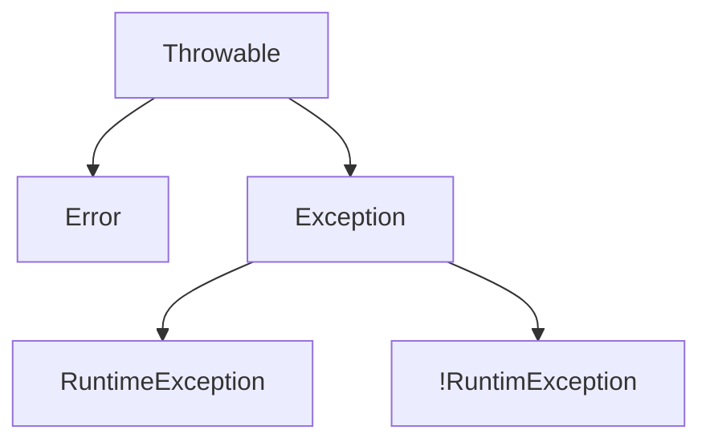

# 1.异常

## 1.1 概述

- 异常：程序在执行过程中，发生的非正常的情况，最终会导致JVM异常停止
- 注：语法错误，不是异常
- 作用
  - 根据提示，解决异常
  - 异常的处理方式
  - 自定义异常
- Java中所有的异常，都是以类的形式体现

## 1.2 异常的继承体系结构



- Error：重大错误，一般是程序员无法解决的
- Exception：异常
  - RuntimeException 及其子类：运行时异常，即编译通过，运行出错
  - 非RuntimeException 及其子类：编译时异常，即在编译期间检查到的代码可能会出问题，需要给出预解决方法
    - 没有出现问题：无报错
    - 出现问题：编译会按照给出的预解决方案进行处理

```java
public static void main(String[] args) throw FileNotFundException{ //提前给出预解决方案。但此种方法会影响程序的执行
  FileReader fr = new FileReader("User/tyy/Desktop");
}
```

```java
public static void main(String[] args){  //此种方式，不会影响程序的执行
  try{
    FileReader fr = new FileReader("User/tyy");
  }catch(FileNotFoundException e){
    sout("后期修改");
  }
  sout("不影响执行");
}
```


## 1.3 常见运行时异常

- 运行时异常，一般是由于业务没有考虑清楚、编程逻辑不严谨导致

1. 数组索引越界异常 ArrayIndexOutOfBoundsException
2. 空指针异常 NullPointException
3. 数学运算异常 ArithmeticException
4. 类型转换异常 ClassCastException
5.  数字转换异常 NumberFormatException


## 1.4 异常处理方法

### 1.4.1 JVM默认处理方法

- 将问题抛给上级，不断的向上抛出，直到程序终止，在控制台打印错误信息

```java
//Test.java
public class Test{
  public static void method(){
    sout("开始");
    sout(10 / 0); //由于除数不能为0，所以此处会出现ArthmeticException异常
    sout("结束");
  }
  
  public static void main(String[] args){
    method();
  }
}
```

JVM处理步骤：

1. 在出现异常时，首先创建异常对象：new ArthmeticException( );
2. JVM的默认处理方式：将异常抛给上级，此处，异常发生在method方法中，method方法将异常抛给上级main方法。也可以理解为，谁调用，就抛给谁
3. main方法收到异常，也会执行默认的处理方式：抛给上级；main方法是JVM调用的，所以main方法将异常抛给了JVM、
4. JVM接收到异常后，也会执行默认的处理方式：抛给上级，而JVM的上级就是程序员
5. JVM抛出问题的具体体现：
   1. 将程序停止
   2. 将错误信息展示在控制台中

### 1.4.2 异常捕获

```java
//格式
try{
  可能有异常的语句;
}catch(要捕获的异常对象){
  异常处理方案;
}

//案例
try{
  sout(10 / 0); // 产生异常，创建异常对象： new ArithmeticExecption()
}catch(Arithmetic e){ //捕获时：ArithmeticException e = new ArithmeticException(); 注意：异常也是类！！
  //此处相当于是创建了异常类的引用，存放异常对象
  sout("捕捉到异常，除数为0.");
}
```

执行步骤：

1. 执行try中的语句

   1. 有异常：catch捕获异常，执行catch中的异常处理方案
   2. 没有异常：catch不会捕获，跳过异常处理方案，代码继续向下执行

   

### 1.4.3 异常抛出

- 抛出运行时异常：通过throw关键词直接抛出；
- 抛出编译时异常：除了需要throw关键字，还需要在通过throws关键字进行声明；即告知调用者，此方法中有异常；

```java
//抛出运行时异常
public void setAge(int age){
  if (age >= 1 && age <= 120){
    this.age = age;
  }else{
    throw new RuntimeException("输入年龄有误！");
  }
}

//抛出编译时错误
public void setAge(int age) throws Exception{  // Exception 为编译时异常，需要通过throws关键字进行声明
  if (age >= 1 && age <= 120){
  	this.age = age;
  }else{
    throw new Exception("输入的年龄有误！！"); 
  }
}
```


## 1.5 异常处理案例

```java
//用户键盘录入数字字符串，将其转为数字，若输入错误，则重新输入直到正确
//思路：键盘录入：Scanner；2.字符串转数字：Integer；3.输入直到正确：while循环；4.错误：捕获错误，防止程序终止
Scanner in = new Scanner(System.in);
sout("输入整数数字");

while(true){ //不明确循环次数，使用while循环
  try{
    int num = Integer.parseInt(in.nextLine()); //当发生异常时，程序停止向下执行，生成异常对象，被catch捕获，执行异常处理方案；
   	sout(num);  //后面的这两条代码，只有在没有发生异常时，才执行
    break;
  }catch(NumberFormatException e){
    sout("请输入整数数字！！");
  }
}
```


## 1.6 异常处理常用方法

| 方法                           | 说明                                               |
| ------------------------------ | -------------------------------------------------- |
| public void printStackTrace( ) | 打印异常的完整信息，包括错误的行数等；最常用的方法 |
| public String getMessage( )    | 返回异常的简单描述                                 |
| public String toString( )      | 返回异常的简单描述，包含异常的类名                 |


## 1.7 异常处理细节

### 1.7.1 final

- finally 中的语句一定会被执行

```java
try{
  可能出现异常的语句;
}catch(捕获的异常对象){
  异常处理语句;
}finally{
  一定会执行的语句;
}
```

```java
try{
  sout(10 / 0); //new ArthmeticException()
  int[] arr = null;
  sout(arr[10]); //new ArrayIndexOutOfBoundException()
}catch(ArthmeticException e){
  sout("捕获异常");
}finally{
  sout("坚强");
}
sout("执行");
//此部分代码，按理来说，只捕获了ArthmeticException异常，另一个异常没有捕获，是会报错的？实际不会报错！！
//原因：程序执行时，一旦遇到异常，创建异常对象之后，会直接执行catch语句，其后的语句根本不会执行
//若ArrayIndexOutOfBoundException异常防在最前面的话，就会报错！！因为没有对其进行捕获!其后的语句时不会执行的，但是！！finally中的语句依旧会执行！
```

### 1.7.2 多个catch

- 可以同时捕捉多个异常，但父类异常要放在最后

```java
try{
  sout(10 / 0);
}catch(AritmeticException e){
  处理方案；
}catch(ArrayIndexOutOfBoundException e){
  处理方案；
}
```

- 可以大范围捕获异常
- 注:大范围的捕获，是针对有没有想到的异常发生，需要放在最后进行捕获;若放在前民，则会捕获所有异常，后面的catch语句将无法执行
- 缺点：缺乏针对性，无法及时明确异常类型

```java
try{
  可能产生异常的语句;
}catch(ArrayIndexOutOfBoundException e){
  处理方案;
}catch(ArithmeticException e){
  处理方案;
}catch(Exception e){ //此处参数放的是所有异常的父类：Exception类，需要传入其子类对象；即，他可以接收所有的子类异常
  处理方案;
}
```

### 1.7.3 多个异常可用 | 隔开

- 缺点：不精确，无法精准定位异常

```java
try{
  sout(10 / 0);
}catch(ArrayIndexOutOfBoundException | ArithmeticException e){
  sout("捕获多个异常");
}
```

### 1.7.4 子父类中的异常

- 子类不能抛出父类中没有的异常
- 子类不能抛比父类异常更大的异常

```java
public class Fu{
  public void method() throws ArrayIndexOutOfBoundsExceptino,NullPointException{
    throw ...
  }
}

public class Zi extends Fu throws ArrayIndexOutOfBoundsExceptino{
  throw ...
}
```

- 父类方法没有抛出异常，子类若重写父类方法，若有异常，只能通过try...catch捕获异常

```java
public class Fu{
  public void method() {
   
  }
}

public class Zi extends Fu{
  try{
    ..
  }
}
```


## 1.8 自定义异常

- 期望有范围跟小的、更准确的异常信息
- 实现方式：自己创建一个类，去继承一个异常类即可

### 1.8.1 自定义运行时异常

- 定义一个类去继承RuntimeException类
- 重写构造方法
- 在出现异常的地方使用 throw new 自定义对象，抛出
- 特点：提醒不强烈，编译时不会报错，只有在运行时才可能出现！

```java
//StudentAgeException.java
public class StudentAgeException extends RuntimeException{ //继承自运行时异常类，那么此自定义异常就属于运行时异常了
  public StuentAgeExcepton(){  //重写构造方法
    
  }
  public StudentAgeException(String message){
    super(message);
  }
}
```

### 1.8.2 自定义编译时异常

- 定义一个类去继承Exception类，由于为编译时异常，记得使用throws声明异常
- 重写构造方法
- 在出现异常的地方使用 throw new 自定义对象，抛出
- 特点：编辑阶段就会报错，提醒更加强烈，一定需要先处理！