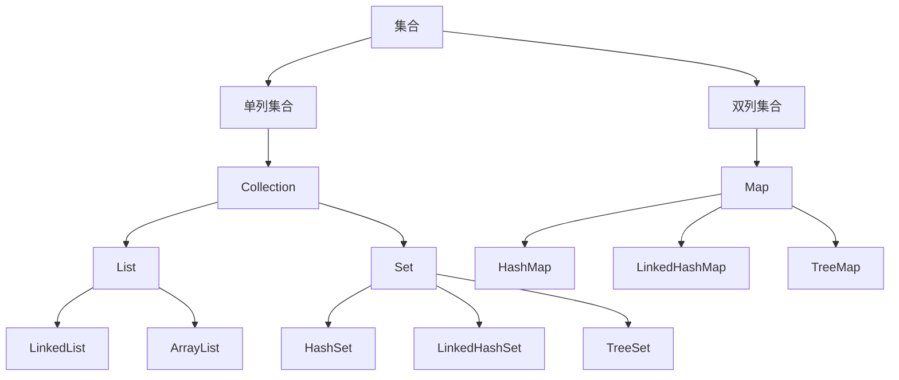

# 1.集合体系

## 1.1 回顾

|          | 数组                       | 集合                               |
| -------- | -------------------------- | ---------------------------------- |
| 长度     | 创建后不可改变             | 可随时改变                         |
| 数据类型 | 基本数据类型、引用数据类型 | 引用数据类型、基本数据类型的包装类 |
| 使用场景 | 长度不会发生改变           | 长度经常发生改变                   |


## 1.2 概述



- 单列集合：一次存储一个数据
  - 根接口：Collection
    - List接口：存取有序，有索引，可重复
      - ArrayList类：数组结构
      - LinKedList类：链表结构
    - Set接口：存取无需，无索引，不可重复
      - HashSet类：哈希表结构
      - LinkedHashSet类：链表 + 哈希表结构
      - TreeSet类：红黑树结构
- 双列集合：一次存储一对数据
  - 根接口：Map
    - HashMap类：哈希表结构
    - LinkedHashMap：链表 + 哈希表结构
    - TreeMap：红黑树结构

# 2.Collection

## 2.1 常用方法

| 方法                              | 说明                                                |
| --------------------------------- | --------------------------------------------------- |
| public boolean add(E e)           | 将指定对象添加到集合中（若不允许、重复就返回false） |
| public void clear()               | 清除集合中的所有元素                                |
| public boolean contains(Object o) | 判断集合是否包含指定对象                            |
| public boolean remove(E e)        | 从集合删除指定对象                                  |
| public boolean isEmpty()          | 判断集合是否为空                                    |
| public int size()                 | 返回集合元素个数                                    |

```java
Collection<String> c = new ArrayList<>();
//此处使用多态的方式，是为了使用Collection中的共有的方法
c.add("A");
c.size();
c.contains("A");
c.remove("A");
c.isEmpty();
c.clear();
```


### 2.1.1 remove与contains方法细节

- remove方法、contains方法都需要**传入对象**，将对象与集合中的各个对象进行比较，而比较就**依赖于equals方法**
- 若想要在集合中使用equals方法比较两个对象是否相同（内容相同），需要提前重写equals方法
  - 原因：equals方法是Object类中的成员方法，默认是比较两个对象的地址值是否相同，无法比较内容是否相同，若想要比较内容，则需要在类中**重写equals方法**

```java
Collection<Student> c = new ArrayList<>();
c.add(new Student("A",20));
c.add(new Student("B",21));
c.contains(new Student("A",20)); //false，contains方法依赖equals方法，equals方法默认比较对象的地址值
```


## 2.1 Collection的遍历

### 2.1.1 迭代器遍历

使用步骤：

1. 通过集合对象获取迭代器
   1. Iterator it = 集合对象.iterator( );
2. 调用迭代器对象的 hasnext( )方法，判断集合是否存在元素
   1. it.hasnext( );
3. 调用迭代器对象的next( )方法，获取集合元素
   1. it.next( );
   2. 注意：每调用一次next，就会**取出**集合中的一个元素,然后**指向下一个元素**；若集合中没有元素，则抛出NoSuchElementException

```java
Collection<Student> list = new ArrayList<>();  //创建collection对象
list.add(new Student("A",20)); //向集合添加对象
list.add(new Student("B",21));
list.add(new Student("C",23));

Iterator<Student> it = list.iterator();  //通过集合对象调用iterator，创建迭代器对象
while(it.hasnext()){ //通过迭代器对象调用hasnext方法，判断集合是否有元素，有则执行语句
  Student stu = it.next(); //通过迭代器对象调用next方法，取出集合中的元素；注：next调用取出数据后，就会指向下一个元素；即：it.next().getName().getAge() 这种链式编程的方法不适用：在getName之后，next就指向了下一个对象，getAge就会获取下一个对象的年龄，且最后会报错；
  sout(stu);
}
```

```java
//迭代器源码简化版
public Iterator<E> iterator(){  //调用iterator方法时
  return new Itr(); //返回Itr类的对象
}

private class Itr implements Iterator<E>{  //Itr类，实现了Iterator接口
  int cursor;  //int类型，默认为0，即集合首位的索引号
  
}

public boolean hasNest(){  //判断集合是否有元素
  return cursor != size;
}

public E next(){  //从集合中取出元素
  int i = cursor; //先将cursor的值赋给变量i
  cursor = i + 1; //cursor+1，即指向下一个索引位置
  return (E) elementData[i]; //返回当前位置的元素
}
```


